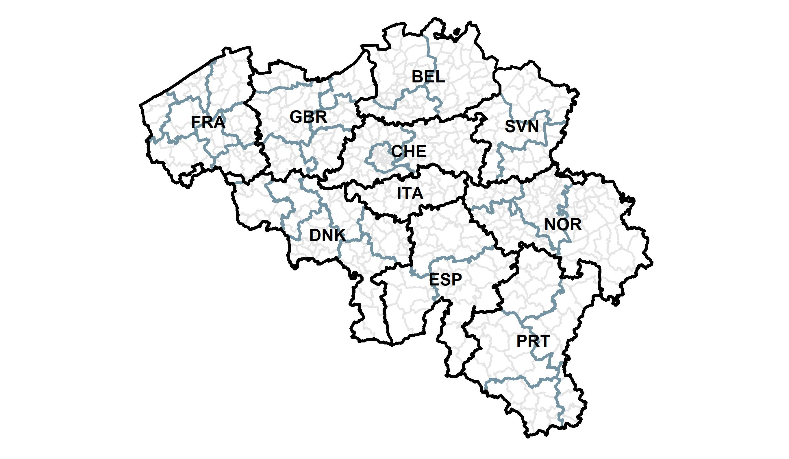
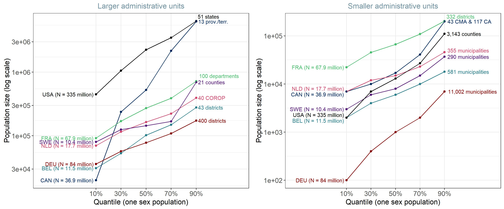
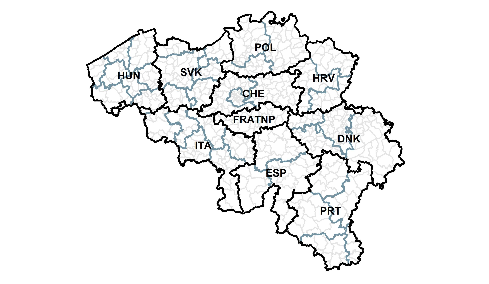
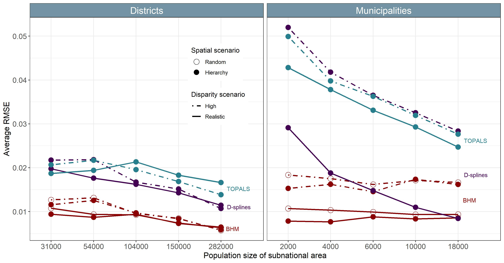
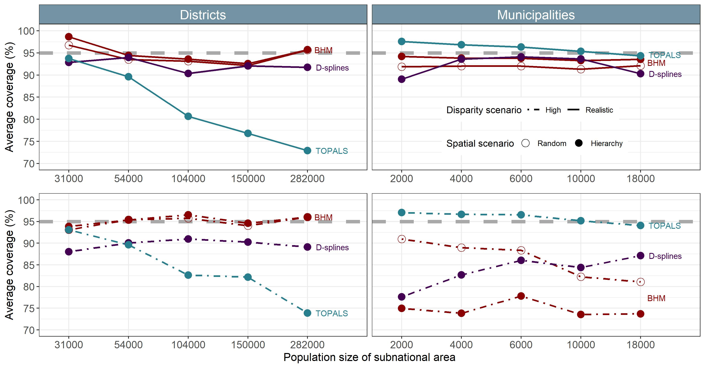
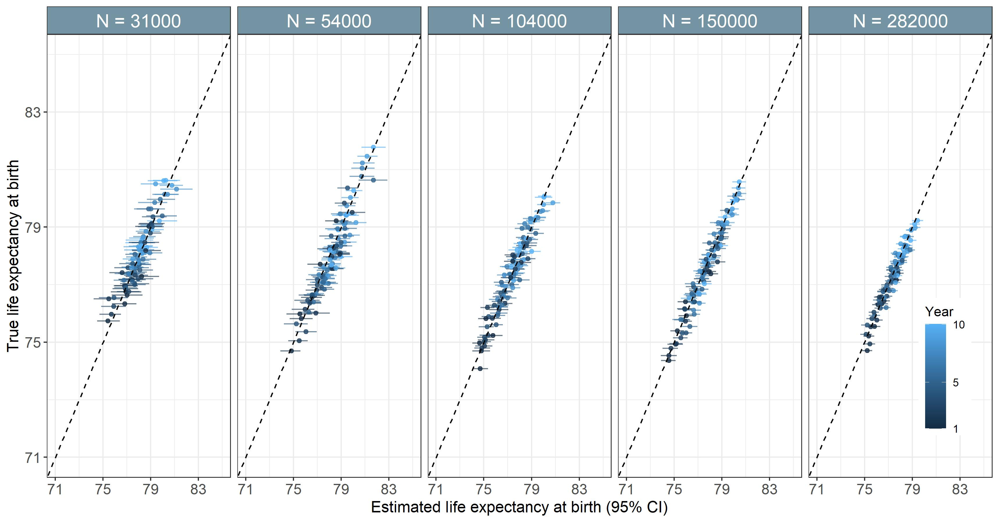
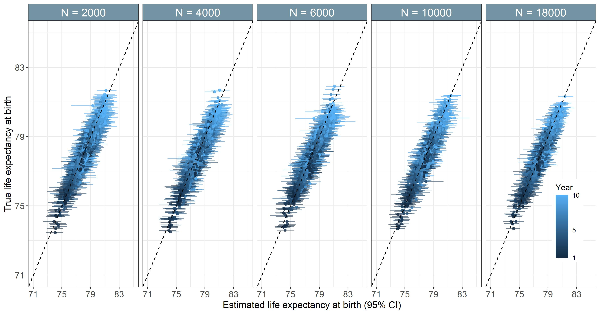
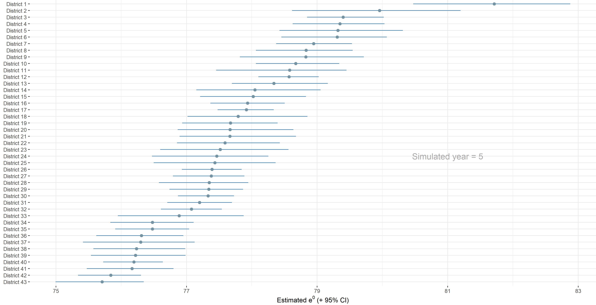
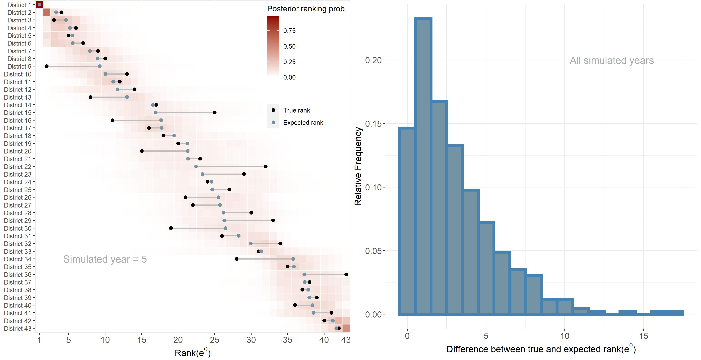
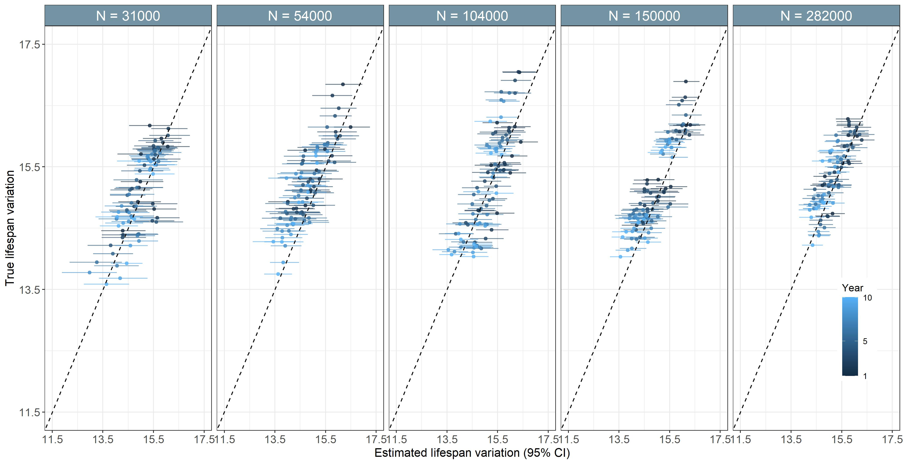

class: inverse, center, middle

```{r setup, include=FALSE}
knitr::opts_chunk$set(fig.retina = 3, fig.width = 6, fig.asp = 0.618, out.width = "70%", fig.align = "center", warning = FALSE, message = FALSE, echo = FALSE)

packages <- c("tidyverse", "ggplot2", "HMDHFDplus", "viridis", "scales",
              "forecast", "cowplot", "RColorBrewer", "raster", "spdep",
              "broom", "leaflet")
invisible( lapply(packages, library, character.only = TRUE))

```

# The performance of small-area mortality estimation models

## A simulation study

.large[Benjamin Schlüter]

.large[Bruno Masquelier]

<br/>

.large[Midi de la recherche| 18 Oct 2022]

```{r out.width = '20%'}
# logo needs to be both in wd and where .Rmd is located

```
```{r out.width = '20%'}
# logo needs to be both in wd and where .Rmd is located

```


---

# Context


Age-specific mortality rates (= mortality age schedule): input for demographic indicators

* Standardized mortality rates

* Life expectancy at birth, $e^0$

* Lifespan variation 

Why do we need accurate mortality estimates by age and subnational areas?

* Document health inequalities

* Guide resource allocation

* Evaluate local policy measures

* Target areas most in need

<br/>


???

* __Within__ a country...

--

.center[`r fontawesome::fa("exclamation")`  .highlight[Small population = unreliable mortality measurements]  `r fontawesome::fa("exclamation")`]


---

# Stochasticity in death counts

.pull-left[
```{r fig_stoch_fr, out.width = "80%", fig.cap = "France 2007, female"}
ctry <- "FRATNP"
years <- 2007

expos <- read.table(paste0("../../data/simulation/",ctry, "_E_1x1.txt"), 
                    header=T) %>%
        filter(Year %in% years) %>% 
        pivot_longer(Female:Total, names_to = "sex", values_to = "exp") %>% 
        # remove symbol - and + and keeps what's before
        mutate(age = sub("\\-.*|\\+.*", "", Age),
               age = as.numeric(age),
               sex = case_when(sex == "Female" ~ "f",
                               sex == "Male" ~ "m",
                               TRUE ~ "t"),
               exp = as.numeric(exp))


dths <- read.table(paste0("../../data/simulation/",ctry, "_D_1x1.txt"), 
                   header=T) %>%
        filter(Year %in% years) %>% 
        pivot_longer(Female:Total, names_to = "sex", values_to = "dth") %>% 
        # remove symbol - and + and keeps what's before
        mutate(age = sub("\\-.*|\\+.*", "", Age),
               age = as.numeric(age),
               sex = case_when(sex == "Female" ~ "f",
                               sex == "Male" ~ "m",
                               TRUE ~ "t"),
               dth = as.numeric(dth)) 

expos %>%
        left_join(dths,
                  by = c("age", "sex")) %>%
        mutate(nmx = dth/exp) %>%
        filter(sex == "f") %>% 
        ggplot(aes(x = age, y = nmx, col = sex, group = sex)) +
        geom_point(col = "#7494A4") +
        theme_bw() +
        scale_y_log10() +
        labs(y = "Raw nMx",
             x = "Age")

```
]

--

.pull-right[
```{r fig_stoch_be, out.width = "80%", fig.cap = "Belgium 2007, female"}
ctry <- "BEL"
years <- 2007

expos <- read.table(paste0("../../data/simulation/",ctry, "_E_1x1.txt"), 
                    header=T) %>%
        filter(Year %in% years) %>% 
        pivot_longer(Female:Total, names_to = "sex", values_to = "exp") %>% 
        # remove symbol - and + and keeps what's before
        mutate(age = sub("\\-.*|\\+.*", "", Age),
               age = as.numeric(age),
               sex = case_when(sex == "Female" ~ "f",
                               sex == "Male" ~ "m",
                               TRUE ~ "t"),
               exp = as.numeric(exp))


dths <- read.table(paste0("../../data/simulation/",ctry, "_D_1x1.txt"), 
                   header=T) %>%
        filter(Year %in% years) %>% 
        pivot_longer(Female:Total, names_to = "sex", values_to = "dth") %>% 
        # remove symbol - and + and keeps what's before
        mutate(age = sub("\\-.*|\\+.*", "", Age),
               age = as.numeric(age),
               sex = case_when(sex == "Female" ~ "f",
                               sex == "Male" ~ "m",
                               TRUE ~ "t"),
               dth = as.numeric(dth)) 

expos %>%
        left_join(dths,
                  by = c("age", "sex")) %>%
        mutate(nmx = dth/exp) %>%
        filter(sex == "f") %>% 
        ggplot(aes(x = age, y = nmx, col = sex, group = sex)) +
        geom_point(col = "#7494A4") +
        theme_bw() +
        scale_y_log10() +
        labs(y = "Raw nMx",
             x = "Age")

```
]

--

.pull-left[
```{r fig_stoch_dist, out.width = "80%", fig.cap = "Namur district 2007, female"}
df.bel <- readRDS("../../../subnational_covid_bel/data/tidy/df_ageyearsexadmins_extrapol2020exp.rda")

df.bel %>% 
        filter(dist == "Arrondissement de Namur",
               year == 2007,
               sex == "f") %>% 
        group_by(age) %>% 
        summarise(dth = sum(dth),
                  exp = sum(exp)) %>% 
        ungroup() %>% 
        mutate(nmx = ifelse(dth != 0, dth/exp, NA)) %>% 
        ggplot(aes(x = age, y = nmx)) +
        geom_point(col = "#7494A4") +
        theme_bw() +
        scale_y_log10() +
        labs(y = "Raw nMx",
             x = "Age")
```
]

--

.pull-right[
```{r fig_stoch_muni, out.width = "80%", fig.cap = "Namur municipality 2007, female"}
df.bel %>% 
        filter(commune == "Namur",
               year == 2007,
               sex == "f") %>% 
        group_by(age) %>% 
        summarise(dth = sum(dth),
                  exp = sum(exp)) %>% 
        ungroup() %>% 
        mutate(nmx = ifelse(dth != 0, dth/exp, NA)) %>% 
        ggplot(aes(x = age, y = nmx)) +
        geom_point(col = "#7494A4") +
        theme_bw() +
        scale_y_log10() +
        labs(y = "Raw nMx",
             x = "Age")
```
]

--

.center[
.highlight[Variability] & .highlight[Zeros]
]


???

* "Several models have been proposed to overcome these difficulties"


---

# Small-area mortality estimation models 

.highlight[Models without area-level covariates]: endogeneity bias

.highlight[Models impose demographic regularity]: plausible shape

--

.highlight[Bayesian Hierarchical Models (BHM)]: leverage similarities in the data


--

```{r tab_models}
library(tidyverse)

models <- c("Schmertmann (2021)", "Schmertmann & Gonzaga (2016, 2018, 2020)", "Congdon (2009)", "Alexander et al. (2017)")
hier <- c("No", "No/Yes", "Yes", "Yes")
demo_comp <- c("Penalizes deviations from HMD schedules", "Standard mortality age schedule", "None", "Singular value decomposition")
name <- c("D-splines", "TOPALS", "", "BHM")

tab_models <- tibble("Model" = models,
                     "Hierarchical" = hier,
                     "Demographic regularity" = demo_comp,
                     "Name" = name
                     )
tab_models %>% 
   knitr::kable(format = "html") %>% 
  kableExtra::row_spec(0, background = "#7494A4") %>%
  kableExtra::row_spec(1, background = "#8FBC8F") %>% 
  kableExtra::row_spec(2, background = "#8FBC8F") %>% 
  kableExtra::row_spec(4, background = "#7F152B")

```

--

`r fontawesome::fa("arrow-right")` Hierarchy: 2 administrative levels (Admin 1 and 2)


???

* Schmertmann hierarchical and Congdon not considered in this presentation

* Bayesian models offer an additional tool to stabilize small-scale mortality estimation

* Bayesian modeling: natural framework for __hierachical__ modeling

* Admin1 = province and Admin2 = district/municipality: we care about Admin 2 mortality.


---
class: inverse, center, middle

# Resarch questions:

.left[
## 1. Compare the performance of the BHM with smoothing techniques encountered in small-area mortality estimation (TOPALS, D-splines) applied in a subnational context

## 2. Assess the capability of the BHM to reliably estimate quantities of interest in a subnational context
] 


---

# The need for a simulation

```{r fits_simu, out.width = "90%", fig.cap = "Namur municipality 2007, female"}
df.fit <- df.bel %>% 
        filter(commune == "Namur",
               year == 2007,
               sex == "f",
               age != "100") %>% 
        group_by(age) %>% 
        summarise(dth = sum(dth),
                  exp = sum(exp)) %>% 
        ungroup() %>% 
        mutate(nmx = ifelse(dth != 0, dth/exp, NA),
               age = as.character(age) %>% as.numeric,
               L = age, 
               H = case_when(age == 0 ~ L + 1,
                             age == 1 ~ L + 4,
                             TRUE ~ L + 5))

# Functions
source("../../code/function/TOPALS_fit.R")
source("../../code/function/Dspline_fit.R")

# Age groups
boundaries <- c(0, 1, seq(5, 100, 5))

# Matrix to convert one-year age group into G group
ngroup = length(unique(df.fit$age))
age = 0:99
nage = length(age)
W = matrix(0, nrow=ngroup, ncol=nage)
boundary_ages = c(unique(df.fit$age), max(df.fit$age)+5)
ix = cbind(as.numeric( cut( age, breaks = boundary_ages, right=FALSE) ), seq(age) )
W[ix] = 1
W = prop.table(W,margin=1)  

## TOPALS
# Standard for Male and Female
lambda_star <- readRDS("../../data/simulation/lambda_star.rda")[1:100, 2]


get_topals <- function(E, D, ...) {
        
        fit = TOPALS_fit(N = E, 
                         D = D,
                         std = lambda_star,
                         age_group_bounds = boundaries,
                         details = TRUE)
        
        # Continuous age: Convert using weighting matrix
        mx = exp(fit$logm)
        mx = W %*% mx
        
        return(mx)
}

df.fit <- df.fit %>% 
  mutate(fit.topals = get_topals(df.fit$exp, df.fit$dth) %>% 
           as.numeric)

## D-splines
load(url('http://bonecave.schmert.net/general_Dspline_constants.RData'))

this_gender_code <- "F"
this_method <- "D-LC"

get_dspline <- function(D, E, L, H, ...) {
        
        this_sex = c('F'='Female', 'M'='Male')[this_gender_code]
        
        fit = Dspline_fit(N=E, D=D, 
                          age_group_lower_bounds = L,
                          age_group_upper_bounds = H,
                          Amatrix   = Dspline_constants[[this_sex]][[this_method]]$A,
                          cvector   = Dspline_constants[[this_sex]][[this_method]]$c,
                          SIGMA.INV = Dspline_constants[[this_sex]][[this_method]]$SIGMA.INV,
                          max_iter  = 50,
                          details=TRUE)
        
        # Continuous age: Convert using weighting matrix
        mx = exp(fit$lambda.hat)
        mx = W %*% mx
# Merge data & outputs together
        return(mx)
}

df.fit <- df.fit %>% 
  mutate(fit.dsplines = get_dspline(df.fit$dth, df.fit$exp, 
                                    df.fit$L, df.fit$H) %>% 
           as.numeric)

df.fit %>% 
        ggplot(aes(x = age, y = nmx)) +
        geom_point(col = "#7494A4") +
        # geom_line(aes(y = fit.topals, col = "Model X")) + 
        # geom_line(aes(y = fit.dsplines, col = "Model Y")) +
        theme_bw() +
        theme() +
        scale_y_log10(limits = c(0.00005, 0.7)) +
        scale_color_manual(values = c("Model X" = "red4",
                                      "Model Y" = "skyblue3")) +
        labs(y = "Raw nMx",
             x = "Age")

```


---

# The need for a simulation

```{r fit1_simu, out.width = "90%"}
df.fit %>% 
        ggplot(aes(x = age, y = nmx)) +
        geom_point(col = "#7494A4") +
        geom_line(aes(y = fit.topals, col = "Model X")) + 
        # geom_line(aes(y = fit.dsplines, col = "Model Y")) +
        theme_bw() +
        theme(legend.title = element_blank(),
              legend.position = c(0.2, 0.8)) +
        scale_y_log10(limits = c(0.00005, 0.7)) +
        scale_color_manual(values = c("Model X" = "red4",
                                      "Model Y" = "skyblue3")) +
        labs(y = "Raw nMx",
             x = "Age")

```


---

# The need for a simulation

```{r fit2_simu, out.width = "90%"}
df.fit %>% 
        ggplot(aes(x = age, y = nmx)) +
        geom_point(col = "#7494A4") +
        geom_line(aes(y = fit.topals, col = "Model X")) + 
        geom_line(aes(y = fit.dsplines, col = "Model Y")) +
        theme_bw() +
        theme(legend.title = element_blank(),
              legend.position = c(0.2, 0.8)) +
        scale_y_log10(limits = c(0.00005, 0.7)) +
        scale_color_manual(values = c("Model X" = "red4",
                                      "Model Y" = "skyblue3")) +
        labs(y = "Raw nMx",
             x = "Age")

```

`r fontawesome::fa("arrow-right")` True mortality age schedule, ${}_nm_x$, is needed to compare models 

---

# Methodology

.highlight[Simulation of a fictious country]

`r fontawesome::fa("arrow-right")` Mortality age schedules of subnational areas by gender

--

### Comparison metrics

.leftcol70[
* RMSE = $\sqrt{\frac{1}{G}\sum^G_{x=1}(\hat{m}_x - m^{sim}_x)^2}$
* Coverage = $\frac{1}{G}\sum^G_{x=1}1[m_x^{sim} \geq l_x]1[m_x^{sim} < r_x]$
]

.rightcol30[
$m_x^{sim}$ known (simulated)
]

<br/>

computed across scenarios (see later)


???

* accuracy

* calibration


---

# Methodology

### Simulation's requirements

* Coherent mortality age schedules

* Realistic range of life expectancy at birth within the country 

* Time dimension

* Mortality decreases over time

* Temporal stability of the best/worst performing areas

* At least two administrative levels 


???

* Previous work in France and Germany showed that $\Delta e^0 \leq 5-6$


---
class: inverse, center, middle

# Simulation setup


---

# Simulation steps

1.Use Belgian spatial structure (10 provinces $>$ 43 districts $>$ 581 municipalities)

2.Associate Human Mortality Database (HMD) country $i$ mortality to province $p$

3.Set $l_x^{p, s} \equiv l_x^{i, s}$ for province $p$, sex $s$ and HMD country $i$

4.Use Brass relational model $logit(l_x^{a, p[a],s, t}) = \alpha^{a, p[a],s,t} + \beta^{a,p[a],s,t} \cdot logit(l_x^{p[a], s})$ for area $a$ within province $p$, sex $s$ and year $t$ where areas are districts or municipalities

5.Assume and estimate 

$$\begin{bmatrix}\alpha^{p,male,t} \\ \beta^{p,male,t} \\ \alpha^{p,female,t} \\ \beta^{p,female,t} \end{bmatrix} \sim Multivariate~RW(1)~with~drift$$ 
for each province $p$ corresponding to HMD country $i$ over 15 years


---

# Simulation steps

 6.Simulate 
 
$$\begin{bmatrix}\alpha^{a,p[a],male,t} \\ \beta^{a,p[a],male,t} \\ \alpha^{a,p[a],female,t} \\ \beta^{a,p[a],female,t} \end{bmatrix} \sim N(                    \begin{bmatrix}\alpha^{a,p[a],male,t-1} + \hat{drift}^{p[a], male} \\ \beta^{a,p[a],male,t-1} + \hat{drift}^{p[a], male} \\ \alpha^{a,p[a],female,t-1} + \hat{drift}^{p[a], female} \\ \beta^{a,p[a],female,t-1} + \hat{drift}^{p[a], female} \end{bmatrix}, \hat{\boldsymbol\Sigma}_{rescaled}^{p[a]})$$ 
for each area over 10 years

7.Convert simulated $logit(l_x^{a, p[a],s, t})$ into ${}_nm_x^{a, p[a],s, t}$

8.Generate deaths with $D_x^{a, p[a],s, t} \sim Poisson({}_nm_x^{a, p[a],s, t} \cdot E_x^{a, p[a],s, t})$


---

# Provincial mortality 

.leftcol65[
```{r map_hmd_ctry, fig.asp = 1, out.width = "80%"}


```
]

.rightcol35[
Mortality of 10 provinces 

.center[=]

Mortality of 10 HMD countries in 2003, by gender
]

--

.leftcol65[
```{r dev_brass, out.width = "80%"}
radix <- 100000
logit_bel <- read.table(paste0("../../data/simulation/BEL_lt_m_5x1.txt"),
                                      header=T) %>%
                        mutate(Age = ifelse(Age == "110+", 110,
                                            sub("\\-.*", "", Age)),
                               Age = as.numeric(Age),
                               lx = as.numeric(lx)) %>% 
                        filter(Year == 2003,
                               Age> 0,
                               Age<= 100) %>% 
        # Construct logit from lx
                        mutate(lx = lx/radix,
                               yx = 0.5*log((1-lx)/lx),
                               # Replace Inf values if lx equal 0 
                               yx = ifelse(is.infinite(yx),
                                           0.5*log((1-1e-5)/1e-5),
                                           yx),
                               # Create deviation from std
                               "a=0.2, b=1" = 0.2 + yx,
                               "a=0, b=1.15" = 1.15 * yx,
                               "a=-0.4, b=0.8" = -0.4 + 0.8 * yx) %>% 
                                # Easier to perform math on all cases
                        pivot_longer("yx":"a=-0.4, b=0.8", names_to = "pars", values_to = "logit")
        

# Join to avoid looping
        df.lx <- expand.grid(age = c(0, 1, seq(5, 100, 5)),
                               pars = c("yx", "a=0.2, b=1", "a=0, b=1.15", "a=-0.4, b=0.8"))
        df.lx <- df.lx %>% 
                left_join(logit_bel %>%  
                                  rename("age" = Age) %>% 
                                  dplyr::select(age, logit, pars),
                          by = c("age", "pars")) %>% 
                mutate(lx = 1/(1 + exp(2*logit)),
                       # Set radix
                       lx = ifelse(age == 0, 1, lx),
                       pars = ifelse(pars == "yx", "Prov. std", pars),
                       # for line thickness in ggplot
                       bold = ifelse(pars == "Prov. std", "yes", "no"))
                        
ggplot(df.lx, aes(x = age, y = lx, group = pars, col = pars)) +
        geom_line(aes(size = bold)) +
        theme_bw() +
  theme(legend.position = c(0.2, 0.3)) +
        scale_size_manual(values = c(0.5, 1.4)) +
        labs(col = "Brass parameters") +
        guides(size = "none") +
  scale_color_viridis_d(option = "C", begin = 0.1, end = 0.8) +
  labs(y = expression(l[x]),
       x = "Age")
```
]

.rightcol35[

<br/>

.highlight[Brass relational model]

$$logit(l_x^{area}) = a + b \cdot logit(l^{prov.}_x)$$]

???

* Spatial structure of Belgium for our simulation `r fontawesome::fa("arrow-right")` Admin1= 10 provinces, admin2= 43 districts or 581 municipalities

* 1st step: associate to each province a mortality age schedule from a country in the HMD in 2003 for both male and female

* a: level of mortality

* b: relationship between young and old mortality


---

# Correlation between Brass parameters

.leftcol65[
```{r corr_brass_pars, out.width = "80%"}
df.brass.pars <- readRDS("../../data/simulation/brass_pars_t.rda")
ctries.shown <- c("BEL", "GBR_NP")
# Plots Brass pars
df.brass.pars %>% 
  filter(country %in% ctries.shown) %>% 
  mutate(sex = ifelse(sex == "f", "female", "male")) %>% 
  ggplot(aes(x = a, y = b)) +
        geom_point(aes(col = year, shape = sex)) +
        theme_bw() +
        theme() +
        labs(col = "Year",
             title = "a and b estimated over 2004-2017",
             subtitle = expression(l[x]*" of 2003 used as standards")) +
        scale_color_viridis_c(option = "C") +
        facet_wrap(~ country,
                   ncol = 2,
                   scales = "free_y") +
        labs(x = "a",
             y = "b",
             shape = "Gender")

```
]

--

.rightcol35[

<br/>

.highlight[Estimate multivariate random walks with drift on HMD country]
]

--

.leftcol65[
.highlight[For each area simulate]
$$\begin{bmatrix}
a_t^f \\
b_t^f \\
a_t^m \\
b_t^m
\end{bmatrix} 
\sim N(
\begin{bmatrix}
a_{t-1}^f + \hat{drift}^f \\
b_{t-1}^f + \hat{drift}^f \\
a_{t-1}^m + \hat{drift}^m \\
b_{t-1}^m + \hat{drift}^m
\end{bmatrix} 
, 
 \hat{\boldsymbol\Sigma}^{rescaled})$$
]

.rightcol35[

<br/>

* Drift `r fontawesome::fa("arrow-right")` Temporal improvement (differs by province and gender)
 
* Scaling covariance matrices `r fontawesome::fa("arrow-right")` Stability over time
]


???

* ... a and b over __10 years__ for both gender and then, used the Brass relational model to obtain its survival curves and hence, mortality age schedules. Repeat that process for each departments


---

# Scenarios

* Two administrative levels: .highlight[districts] & .highlight[municipalities] 

```{r pop_sizes, fig.asp = 1, out.width = "100%"}


```

<br/>

`r fontawesome::fa("arrow-right")` Calibrated on Belgian population quantiles


---

# Scenarios

* Two spatial structures: .highlight[hierarchy] & .highlight[random]

    * Simulation leads to similarity for areas within the same province

    * Random scenario: simulated mortality age schedules are randomly reshuffled across areas   

---

# Scenarios

* Two levels of disparity: .highlight[realistic] & .highlight[high]

    * Realistic scenario: simulated difference in $e^0$ within the country is around 5 years
    
    * High disparity scenario: change the set of HMD countries associated to provinces and scale $\hat{\boldsymbol\Sigma}_{p[a]}$ to double observed difference in $e^0$
    
```{r alt_ctry, out.width="70%"}

```
    


```{r gen_brass_pars, out.width = "120%"}
# df.areas.pars.sim <- readRDS("../../data/simulation/brass_pars_sim.rda")
# 
# ggplot() +
#         facet_wrap(country ~ par,
#                    ncol = 2,
#                    scales = "free_y") +
#         geom_line(data = df.brass.pars %>% 
#                           filter(year <= 2013,
#                                  country %in% ctries.shown) %>% 
#                           mutate(sex = ifelse(sex == "f", "female", "male"),
#                                  year = year - 2003) %>% 
#                           pivot_longer(a:b, names_to = "par"),
#                   aes(x = year, y = value, col = sex, size = "Estimated (HMD, 2004-13)")) +
#         geom_line(data = df.areas.pars.sim %>% 
#                           rename("country" = reg) %>% 
#                           filter(country %in% ctries.shown) %>% 
#                           mutate(year = as.numeric(year),
#                                  grouping = paste(unit, sex, sep="-"),
#                                  sex = ifelse(sex == "f", "female", "male")) %>% 
#                           pivot_longer(a:b, names_to = "par"),
#                   aes(x = year, y = value, col = sex, group = grouping,
#                       size = "Simulated (Department)"),
#                   alpha = .7) +
#         scale_color_viridis_d(option = "E", begin = 0.1, end = 0.8) +
#         scale_size_manual(name = "Brass parameters",
#                           values = c("Estimated (HMD, 2004-13)" = 1.5, "Simulated (Department)" = 0.5)) +
#   scale_x_continuous(limits = c(1, 10), breaks = seq(1, 10, 1)) +
#         theme_bw() +
#         labs(y = "Value",
#              x = "Year",
#              col = "Gender")

```


---
class: inverse, center, middle

# Simulation outputs


---

# Simulated life expectancy at birth

.pull-left[
```{r e0_real_nuts, out.width = "95%", fig.cap = "Districts, realistic disparity"}

df.reg.nuts3 <- readRDS("../../data/simulation/df_hmd_be_real_NUTS3.rda")


df.reg.nuts3 %>%
        filter(age == 0) %>%
        mutate(sex = ifelse(sex == "f", "female", "male")) %>%
        ggplot(aes(x = year, y = ex, col = reg)) +
        facet_wrap(~ sex,
                   scales = "free_y") +
        geom_jitter(width = 0.2) +
        theme_bw() +
        theme(strip.background = element_rect(fill = "#7494A4"),
              strip.text = element_text(color = "white")) +
        scale_color_viridis_d(option = "C") +
  labs(y = expression(e^0),
       x = "Year",
       col = "''Province''")

```
]

--

.pull-right[
```{r e0_real_lau, out.width = "95%", fig.cap = "Municipalities, realistic disparity"}

df.reg.nuts3 <- readRDS("../../data/simulation/df_hmd_be_real_LAU.rda")


df.reg.nuts3 %>%
        filter(age == 0) %>%
        mutate(sex = ifelse(sex == "f", "female", "male")) %>%
        ggplot(aes(x = year, y = ex, col = reg)) +
        facet_wrap(~ sex,
                   scales = "free_y") +
        geom_jitter(width = 0.2) +
        theme_bw() +
        theme(strip.background = element_rect(fill = "#7494A4"),
              strip.text = element_text(color = "white")) +
        scale_color_viridis_d(option = "C") +
  labs(y = expression(e^0),
       x = "Year",
       col = "''Province''")

```
]

--

.pull-left[
```{r e0_ineq_nuts, out.width = "95%", fig.cap = "Districts, high disparity"}

df.reg.nuts3 <- readRDS("../../data/simulation/df_hmd_be_ineq_NUTS3.rda")


df.reg.nuts3 %>%
        filter(age == 0) %>%
        mutate(sex = ifelse(sex == "f", "female", "male")) %>%
        ggplot(aes(x = year, y = ex, col = reg)) +
        facet_wrap(~ sex,
                   scales = "free_y") +
        geom_jitter(width = 0.2) +
        theme_bw() +
        theme(strip.background = element_rect(fill = "#7494A4"),
              strip.text = element_text(color = "white")) +
        scale_color_viridis_d(option = "C") +
  labs(y = expression(e^0),
       x = "Year",
       col = "''Province''")

```
]

--

.pull-right[
```{r e0_ineq_lau, out.width = "95%", fig.cap = "Municipalities, high disparity"}

df.reg.nuts3 <- readRDS("../../data/simulation/df_hmd_be_ineq_LAU.rda")


df.reg.nuts3 %>%
        filter(age == 0) %>%
        mutate(sex = ifelse(sex == "f", "female", "male")) %>%
        ggplot(aes(x = year, y = ex, col = reg)) +
        facet_wrap(~ sex,
                   scales = "free_y") +
        geom_jitter(width = 0.2) +
        theme_bw() +
        theme(strip.background = element_rect(fill = "#7494A4"),
              strip.text = element_text(color = "white")) +
        scale_color_viridis_d(option = "C") +
  labs(y = expression(e^0),
       x = "Year",
       col = "''Province''")

```
]

???

* Realistic mortality decreases over time

* Realistic disparity in $e^0$

* Temporal stability in performance


---

class: inverse, center, middle

# Performance comparison


---

# Average RMSE

```{r rmse, out.width = "100%"}

```


---

# Average 95% coverage

```{r cov, out.width = "100%"}

```


---
class: inverse, center, middle

# Indicators of interest in a subnational context


---

# Life expectancy at birth


```{r life_exp_dist, out.width = "45%", fig.cap = "Districts, realistic disparity"}

```


```{r life_exp_mun, out.width = "45%", fig.cap = "Municipalities, realistic disparity"}

```


* Correlation = 0.96 for both districts and municipalities
---

# Ranking according to life expextancy at birth

```{r life_exp, out.width = "90%"}

```


---

# Ranking according to life expextancy at birth

```{r rank_e, out.width = "90%", fig.cap = "Districts, realistic disparity"}

```

* More than 80% of expected ranks in $e^0$ are off by less than 5 position out of 43

* Ranking municipalities leads to much higher difference

    * Wider credible intervals for $e^0$
    
    * Higher number of subnational areas

---

# Lifespan variation

```{r lifespan_var, out.width = "90%", fig.cap = "Districts, realistic disparity"}

```

* Correlation = 0.84

---

# Conclusions

* Simulation offers an interesting setup to compare models over scenarios

* Simulation could be used to develop and test new small-area mortality estimation models

* In general, BHM has a better performance in terms of average RMSE and coverage than the two other models considered

* Performance of the BHM is negatively impacted by higher disparity in mortality age schedules present within the country

* Incorrectly specifying the hierarchy in the BHM does not significantly affect the performance

* BHM allows to reliably estimate demographic indicators at district level (life expectancy, ranking, lifespan variation) but metrics related to the overall distribution within the country are less reliable for municipalities (ranking)


---
class: inverse, center, middle

# Thank you for your attention !

<br/>
<br/>

.left[
`r fontawesome::fa("at")` .link-email[[benjamin-samuel.schluter@uclouvain.be](benjamin-samuel.schluter@uclouvain.be)]

`r fontawesome::fa("slideshare")` .link-email[[http://benjisamschlu.github.io/midi_bhm/slides.html](http://benjisamschlu.github.io/midi_bhm/slides.html)]

`r fontawesome::fa("github")` .link-email[[@benjisamschlu](https://github.com/benjisamschlu)]
]